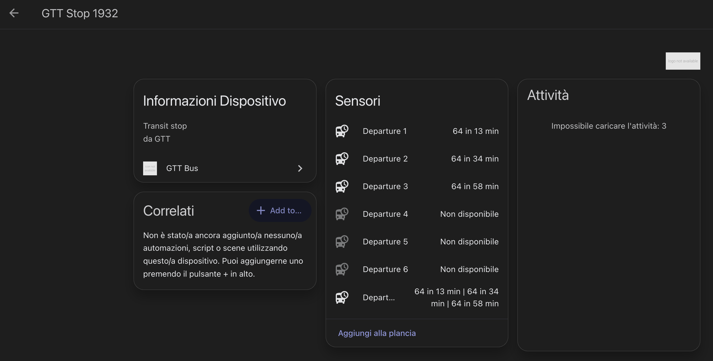
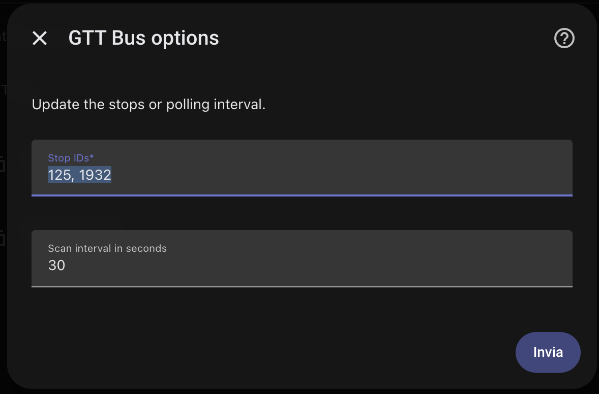
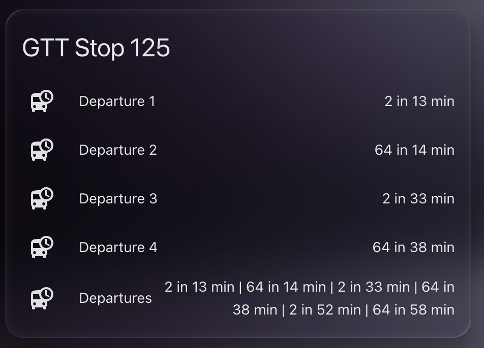

# GTT Bus for Home Assistant

This is a Home Assistant custom integration for the unofficial GTT API:

`http://gpa.madbob.org/query.php?stop=XXX`

It is intentionally not a Home Assistant add-on. This is a custom integration and supports Home Assistant OS, Supervised, and Container/Docker.

## What It Creates

- One summary sensor per configured stop.
- Six departure sensors per stop, so multiple upcoming buses are visible in Home Assistant.
- Summary sensor state like `2 now | 64 in 17 min | 2 in 18 min`.
- Attributes with the next line, scheduled time, minutes until departure, realtime flag, and the full upcoming departures list.

## API, Exposed Entities, and Screenshots

For each configured stop, it exposes:

- `Departures`: summary sensor with a compact upcoming departures string.
- `Departure 1` to `Departure 6`: individual upcoming departure sensors.

Screenshots:

## Installation

Choose the path that matches your Home Assistant setup.

### Path A: Home Assistant OS or Supervised

Option 1 (recommended): install via HACS custom repository.

1. Open HACS.
2. Go to **Integrations**.
3. Open the menu in the top-right corner and choose **Custom repositories**.
4. Add this repository URL (for example, `https://github.com/Emmunaf/homeassistant-gtt-integration/`) and set category to **Integration**.
5. Search for **GTT Bus** in HACS and install it.
6. Restart Home Assistant.

### Path B: Home Assistant run in docker
Option 2: manual install.

1. Copy `custom_components/gtt_bus` into your Home Assistant config at `/config/custom_components/gtt_bus`.
2. Restart Home Assistant.

## Configure

1. Go to **Settings > Devices & services**.
2. Click **Add integration**.
3. Search for **GTT Bus**.
4. Enter stop IDs separated by commas, spaces, semicolons, or newlines, for example `125, 141, 142`.
5. Choose a scan interval. The default is 60 seconds.

Each stop appears as a device named `GTT Stop <stop_id>` and creates these entities:

- `Departures`, a compact summary of all returned departures.
- `Departure 1` through `Departure 6`, one visible entity per upcoming bus.

## Notes

- The API is unofficial and may occasionally break or return empty results.
- Polling faster than 30 seconds is blocked to avoid hammering the public endpoint.
- Failed API calls are retried once after 10 seconds.
- If retry also fails, the integration keeps the last successful value and marks entities with `stale: true` plus `last_error`.
